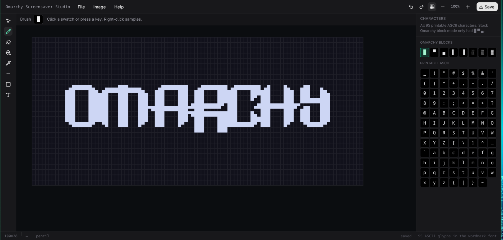

```
                 ▄▄▄
 ▄█████▄    ▄███████████▄    ▄███████   ▄███████   ▄███████   ▄█   █▄    ▄█   █▄
███   ███  ███   ███   ███  ███   ███  ███   ███  ███   ███  ███   ███  ███   ███
███   ███  ███   ███   ███  ███   ███  ███   ███  ███   █▀   ███   ███  ███   ███
███   ███  ███   ███   ███ ▄███▄▄▄███ ▄███▄▄▄██▀  ███       ▄███▄▄▄███▄ ███▄▄▄███
███   ███  ███   ███   ███ ▀███▀▀▀███ ▀███▀▀▀▀    ███      ▀▀███▀▀▀███  ▀▀▀▀▀▀███
███   ███  ███   ███   ███  ███   ███ ██████████  ███   █▄   ███   ███  ▄██   ███
███   ███  ███   ███   ███  ███   ███  ███   ███  ███   ███  ███   ███  ███   ███
 ▀█████▀    ▀█   ███   █▀   ███   █▀   ███   ███  ███████▀   ███   █▀    ▀█████▀
                                       ███   █▀
```

# Omarchy Screensaver Studio

A Photoshop-style ASCII studio for the Omarchy screensaver. The canvas is the art!

You paint every printable ASCII character on a live grid, and the Type tool stamps Delta Corps Priest 1 with digits and punctuation filled in, not just letters.



## Get it

On GitHub: **Code → Download ZIP**. Unzip, then open that folder in a terminal (Super + Return).

Direct link: [omarchy-screensaver-editor-main.zip](https://github.com/fordfisher/omarchy-screensaver-editor/archive/refs/heads/main.zip)

Or clone:

```bash
git clone https://github.com/fordfisher/omarchy-screensaver-editor.git
cd omarchy-screensaver-editor
```

You need Node. Super + Space → Install → Package → `npm`, or:

```bash
omarchy pkg add npm
```

Then:

```bash
npm install
npm run dev
```

Open [http://127.0.0.1:43147](http://127.0.0.1:43147).

## Paint

| Key | Tool |
| --- | --- |
| V | Marquee / move |
| B | Pencil |
| E | Eraser |
| G | Fill |
| I | Eyedropper (right-click samples too) |
| L | Line |
| U | Rectangle |
| T | Type wordmark onto the canvas |

Press any printable key to set the brush (when you're not typing). Wheel zooms. Middle-drag or right-drag pans.

Type: click a cell, type `OMARCHY 4.0!`, Enter commits, Esc cancels. The glyphs land where you clicked.

**File → Convert JPG/PNG** (or **Image → Convert JPG/PNG**) turns a photo into ASCII. Each pixel is a grayscale percent: **0% black → dense glyph**, **100% white → empty**. Drag the black/white points to stretch the range, then stamp onto the canvas.

## Put it on the screensaver

**Save** downloads `screensaver.txt`. Drop it where Omarchy already looks:

```bash
cp ~/Downloads/screensaver.txt ~/.config/omarchy/branding/screensaver.txt
```

No root. Super + Esc fires the screensaver. Or Super + Space → Style → Screensaver.
